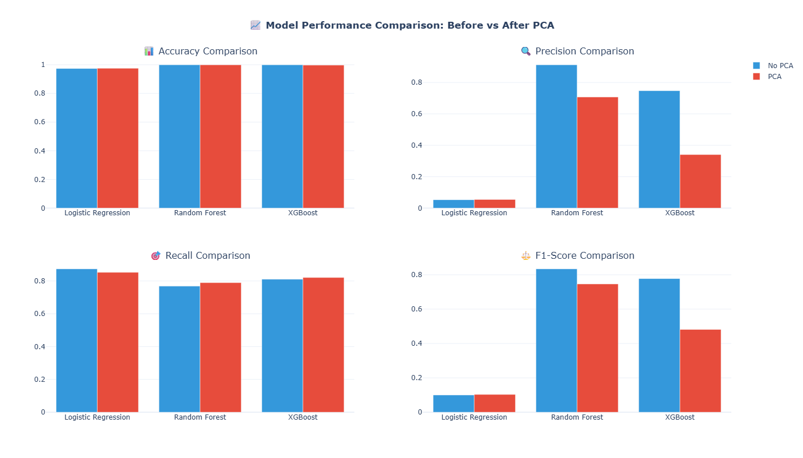

# Credit-Card-Fraud-Detection
# 💳 Credit Card Fraud Detection using Machine Learning

[](https://www.python.org)
[](https://scikit-learn.org/)
[](https://plotly.com/)
[](https://xgboost.ai/)

## 📌 Project Overview
This project focuses on detecting fraudulent credit card transactions using advanced machine learning techniques on a highly imbalanced dataset. 

The main objective is to build a robust fraud detection system that maximizes **Recall** (detecting as many actual fraud cases as possible) while maintaining an acceptable level of **Precision** to avoid overwhelming the system with false positives.

### 🔄 End-to-End Workflow

---

## 📊 Dataset Description
The dataset contains transactions made by credit cards, where we face an extreme class imbalance (mostly normal transactions with a tiny fraction of fraud).

* **Features `V1` to `V28`**: PCA-transformed features to protect user confidentiality.
* **`Time`**: Seconds elapsed between each transaction and the first transaction in the dataset.
* **`Amount`**: Transaction amount.
* **`Class` (Target)**:
  * `0` ➡️ Normal Transaction
  * `1` ➡️ Fraudulent Transaction

---

## 🧹 Data Preprocessing & EDA

1. **Handling Missing Values & Duplicates**: Checked for null values and dropped duplicates to ensure data integrity.
2. **Class Imbalance Visualization**: Visualized the massive gap between normal and fraudulent classes using Plotly.

### 📈 Visualizations

#### 1. Class Distribution
*This plot highlights the severe imbalance in our target variable.*

#### 2. Correlation Heatmap & Transaction Time
*An overview of how features correlate with each other and how transaction frequency changes over time.*
---

## ⚙️ Feature Engineering & Imbalance Handling

### 1. Feature Scaling
Since the `Amount` and `Time` features have vastly different scales compared to the PCA-reduced `V1-V28` features, we applied **`StandardScaler`** to normalize these values.

### 2. Handling Imbalance (SMOTE)
Using standard ML algorithms on this raw data would result in a model that simply predicts "Normal" for everything. To prevent this, we applied **SMOTE (Synthetic Minority Over-sampling Technique)** on the training set to balance the classes.

### 3. Dimensionality Reduction (PCA)
To experiment with performance and training speed, we trained models under two scenarios:
1. **With PCA** (reducing features to the top 10 principal components).
2. **Without PCA** (retaining all scaled features).

---

## 🤖 Models Implemented

We trained and compared three distinct classification algorithms:

| Model | Approach | Strengths |
| :--- | :---: | :--- |
| **Logistic Regression** | Baseline Linear Model | High interpretability, useful baseline with class weights. |
| **Random Forest** | Bagging Ensemble | Highly stable, handles non-linear patterns efficiently. |
| **XGBoost** | Gradient Boosting | State-of-the-art performance on tabular, imbalanced datasets. |

---

## 📊 Performance Comparison: Before vs. After PCA

The models were evaluated comprehensively across key metrics. Below is a comparison of their performance:

### ⏱️ Model Performance Metrics Table

| Model | PCA Status | Accuracy | Precision | Recall | F1-Score |
| :--- | :---: | :---: | :---: | :---: | :---: |
| **Logistic Regression** | ❌ No PCA | 0.9763 | 0.0617 | 0.9146 | 0.1156 |
| **Logistic Regression** |  PCA | 0.9754 | 0.0596 | 0.9146 | 0.1119 |
| **Random Forest** | ❌ No PCA | 0.9995 | 0.8875 | 0.8659 | 0.8765 |
| **Random Forest** |  PCA | 0.9911 | 0.1388 | 0.8537 | 0.2389 |
| **XGBoost** | ❌ No PCA | 0.9995 | 0.8861 | 0.8537 | 0.8696 |
| **XGBoost** |  PCA | 0.9839 | 0.0847 | 0.8659 | 0.1543 |

### 📊 Performance Comparison Chart
<p align="center">
  
</p>

---

## 🔍 Key Insights & Threshold Tuning

* **The PCA Trade-off**: Reducing components with PCA speeded up training, but tree-based models like Random Forest and XGBoost achieved **significantly better Precision and F1-scores** using the original features (Without PCA).
* **Feature Importance**: Using Random Forest (No PCA), we identified the most influential features contributing to fraud detection
* **Threshold Tuning**: Since fraud detection is highly sensitive, we analyzed the impact of changing the classification threshold on the Random Forest model:
  * **Low Threshold (e.g., 0.3)** ➡️ Catches almost all fraud (High Recall) but increases false alarms (Lower Precision).
  * **High Threshold (e.g., 0.7)** ➡️ Reduces false alarms (High Precision) but might miss some fraud (Lower Recall).

### 📈 ROC-AUC Curve
The Receiver Operating Characteristic curve illustrates our model's capability to distinguish between classes:
---

## 🛠️ How to Run this Project

### 1. Clone the repository
```bash
git clone [https://github.com/your-username/Credit-Card-Fraud-Detection.git](https://github.com/Basmala-Ahmedd/Credit-Card-Fraud-Detection.git)
cd Credit-Card-Fraud-Detection

```

### 2. Install dependencies

```bash
pip install -r requirements.txt
```

### 3. Download the Dataset

Download the **creditcard.csv** dataset from Kaggle and place it in the project's root directory.

> **Note:** Due to GitHub file size limitations and dataset licensing, the dataset is not included in this repository.

### 4. Run the Project

Run the following command to train all models, evaluate performance, and automatically save all generated plots in the `assets` folder.

```bash
python fraud_detection.py
```

---

## 🚀 Future Roadmap

- [ ] Implement **RandomizedSearchCV** to explore a broader hyperparameter space.
- [ ] Test advanced oversampling techniques such as **ADASYN**.
- [ ] Deploy the best-performing model as a real-time API using **Streamlit** or **FastAPI**.
- [ ] Explore Deep Learning architectures (e.g., simple neural networks using **PyTorch**).

---

## 📌 Project Status

This project was developed as part of practical research into highly imbalanced financial fraud detection datasets.
